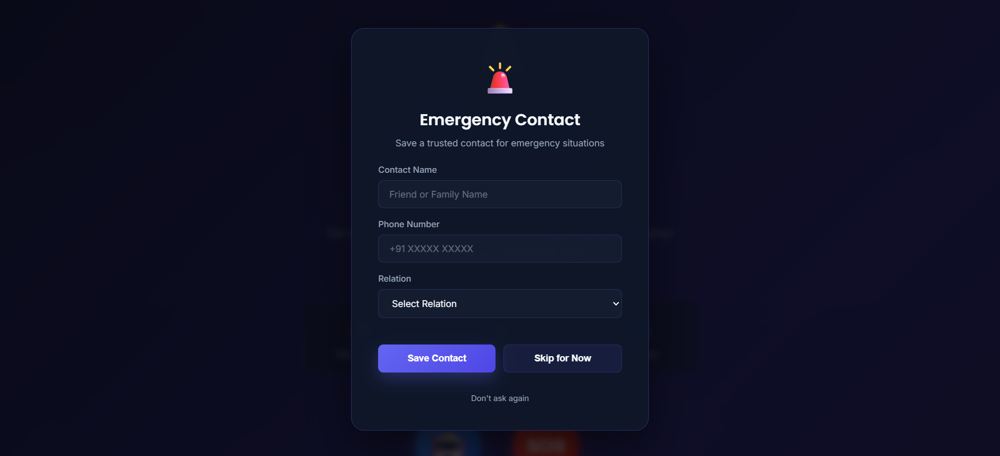
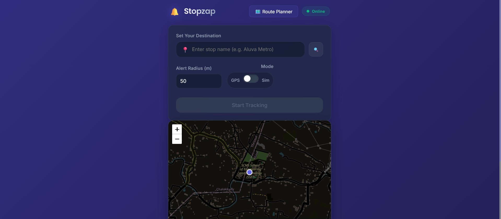
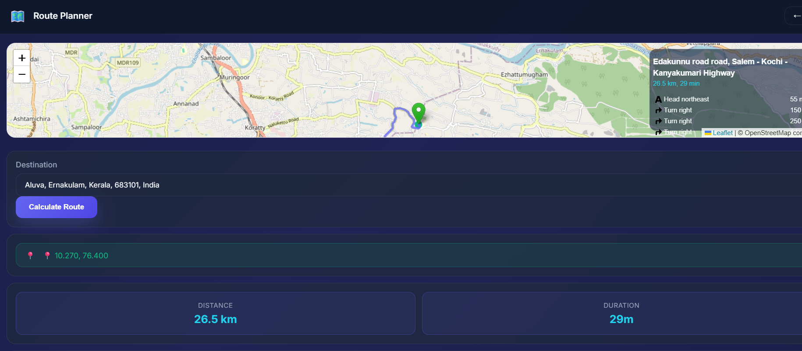
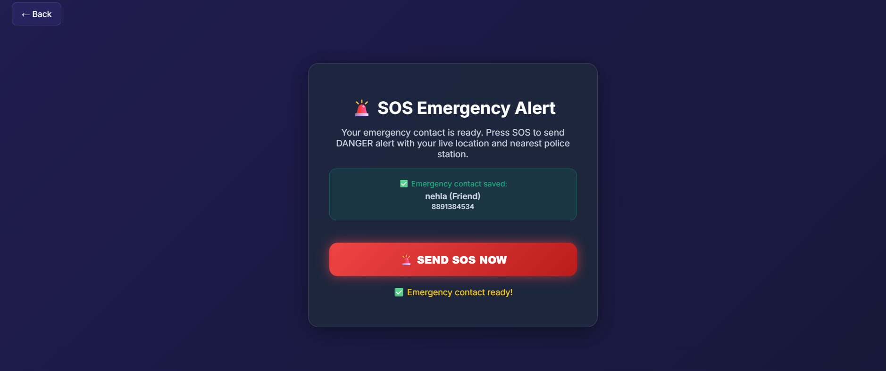
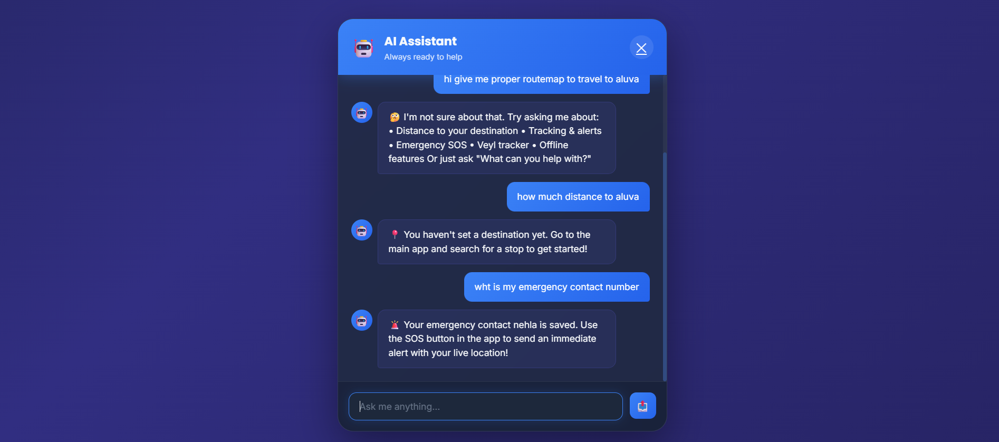

<p align="center">
  
</p>

# StopZap 🎯

## Basic Details

### Team Name: [SheVerse]

### Team Members
- Member 1: [Fathima Nehla P S] - [SCMS School Of Engineering and Technology]
- Member 2: [Hanna Abdul Kareem] - [SCMS School Of Engineering and Technology]

### Hosted Project Link
stopzap-ik8e.vercel.app

### Project Description
[Stopzap is a smart GPS-powered Progressive Web App that ensures you never miss your bus or train stop again with real-time proximity alerts, live mapping, and customizable alert radius. It features an AI assistant chatbot for journey support, emergency SOS alerts with location sharing and nearest police station detection, sun/shade tracking via Veyl for smart seat selection, offline functionality, and a simulation mode for testing—all wrapped in an intuitive dark-themed interface with offline-first capabilities.]

### The Problem statement
[Commuters frequently miss their bus or train stops due to distractions or unfamiliarity with routes, wasting time and money. They lack a comprehensive tool that combines real-time proximity alerts, emergency safety features, and offline accessibility to enhance their transit experience and safety.]

### The Solution
[Solution - Key Points:

• Automatic proximity-based alerts when approaching destination
• Real-time GPS tracking with live distance display
• Emergency SOS with location sharing & police station detection
• AI chatbot assistant for journey queries
• Offline-first PWA with simulation mode

Why Stopzap Beats Google Maps:

• Automatic Alerts - Notifies you automatically vs manual checks in Google Maps
• Emergency Safety - Built-in SOS with police detection (Google Maps lacks this)
• Lightweight PWA - Works instantly in browser, no installation needed
• Full Offline Support - Works without internet connectivity
• Transit-Focused - Purpose-built for commuters with AI chatbot & simulation mode]

---

## Technical Details

### Technologies/Components Used

**For Software:**
- Languages used: HTML5, CSS3, JavaScript (ES6+)
- Frameworks used:Progressive Web App (PWA), Vanilla JavaScript (no framework)
- Libraries used: Leaflet.js (mapping), Nominatim API (geocoding), Overpass API (police station detection)
- Tools used: VS Code, Git, GitHub, Leaflet Map Library, Service Workers, LocalStorage API

---

## Features

List the key features of your project:

- **Real-time Proximity Alerts:** Automatic notifications when you approach your destination within a customizable radius, ensuring you never miss your stop
- **Emergency SOS with Police Detection:** One-click emergency alert that shares your live location and detects the nearest police station, sending critical information to your saved emergency contact
- **AI Assistant Chatbot:** Interactive chatbot that answers questions about journey status, distance to destination, tracking help, emergency procedures, and app features with intelligent context-aware responses
- **Offline-First Progressive Web App:** Full offline functionality with Service Worker caching - works seamlessly without internet connectivity, with automatic sync when back online
- **Live GPS Tracking & Distance Display:** Real-time location tracking on interactive Leaflet maps with current coordinates and live distance updates to your destination
- **Simulation Mode:** Test your routing without GPS by simulating a journey to your destination - perfect for familiarizing yourself with routes before travel
- **Veyl Sun/Shade Tracker:** Shows sun direction and shade availability on your route, helping you choose the best seat for comfort during your journey
- **Emergency Contact Management:** Pre-save emergency contact details on landing page, instantly accessible during SOS situations for rapid emergency alerts

---

## Implementation

### For Software:

#### Installation
```bash
# Clone the repository
git clone https://github.com/Hannakareem/Stopzap.git
cd stopzap

# No build dependencies required - it's a vanilla PWA!
```

#### Run
```bash
# Option 1: Python server
python -m http.server 8000

# Option 2: Node.js server
npx http-server

# Then visit: http://localhost:5500/index.html
```


## Project Documentation

### For Software:

#### Screenshots (Add at least 3)


*Emergency Contact Modal - Users save their trusted emergency contact (name, phone, and relationship) on the landing page, which is instantly accessible during SOS situations for rapid emergency alerts*


*Stopzap Landing Page - The home interface featuring the app logo, description, feature highlights (Veyl Tracker, Smart Alerts, Live Maps), and two action buttons: AI Assistant chatbot and Emergency SOS*


*Real-time GPS Tracking - The main tracking app showing live map with user location, destination marker, distance-to-stop display, and customizable alert radius for proximity-based notifications*


*Emergency SOS Interface - One-click emergency alert that sends live location, nearest police station information, and danger alert to saved emergency contact via WhatsApp or SMS*


*AI Chatbot - Interactive assistant answering journey questions like distance to destination, tracking status, emergency procedures, offline capabilities, and app features with intelligent responses*


*Veyl Sun/Shade Tracker - Shows sun direction and shade availability on your route, helping commuters choose the best seat position for comfort during their journey*


*Offline Mode & Simulation - Progressive Web App works offline with cached maps and data, plus simulation mode allows users to test routes without real GPS before actual travel*

#### Diagrams

**System Architecture:**


PWA frontend with Geolocation API and Service Worker for offline support. Backend handles SOS alerts, authentication, and chatbot APIs. Leaflet.js maps with Nominatim/Overpass APIs for route planning and police detection. Database stores user data and journey history. Notification Service sends push/SMS/WhatsApp alerts.

**Application Workflow:**


1. User saves emergency contact and enters destination
2. GPS tracking activates with live map display
3. Proximity alert triggers when approaching destination
4. Emergency SOS shares location and nearest police station
5. AI chatbot provides journey assistance
6. Offline mode works with Service Worker caching
7. Veyl tracker shows sun/shade availability
8. Journey history syncs when back online


## Project Demo

### Video
[Add your demo video link here - YouTube, Google Drive, etc.]

*Explain what the video demonstrates - key features, user flow, technical highlights*

### Additional Demos
[Add any extra demo materials/links - Live site, APK download, online demo, etc.]

---

## AI Tools Used (Optional - For Transparency Bonus)

If you used AI tools during development, document them here for transparency:

**Tool Used:** [e.g., GitHub Copilot, v0.dev, Cursor, ChatGPT, Claude]

**Purpose:** [What you used it for]
- Example: "Generated boilerplate React components"
- Example: "Debugging assistance for async functions"
- Example: "Code review and optimization suggestions"

**Key Prompts Used:**
- "Create a REST API endpoint for user authentication"
- "Debug this async function that's causing race conditions"
- "Optimize this database query for better performance"

**Percentage of AI-generated code:** [Approximately X%]

**Human Contributions:**
- Architecture design and planning
- Custom business logic implementation
- Integration and testing
- UI/UX design decisions

*Note: Proper documentation of AI usage demonstrates transparency and earns bonus points in evaluation!*

---

## Team Contributions

- [Name 1]: [Specific contributions - e.g., Frontend development, API integration, etc.]
- [Name 2]: [Specific contributions - e.g., Backend development, Database design, etc.]
- [Name 3]: [Specific contributions - e.g., UI/UX design, Testing, Documentation, etc.]

---

## License

This project is licensed under the [LICENSE_NAME] License - see the [LICENSE](LICENSE) file for details.

**Common License Options:**
- MIT License (Permissive, widely used)
- Apache 2.0 (Permissive with patent grant)
- GPL v3 (Copyleft, requires derivative works to be open source)

---

Made with ❤️ at TinkerHub
