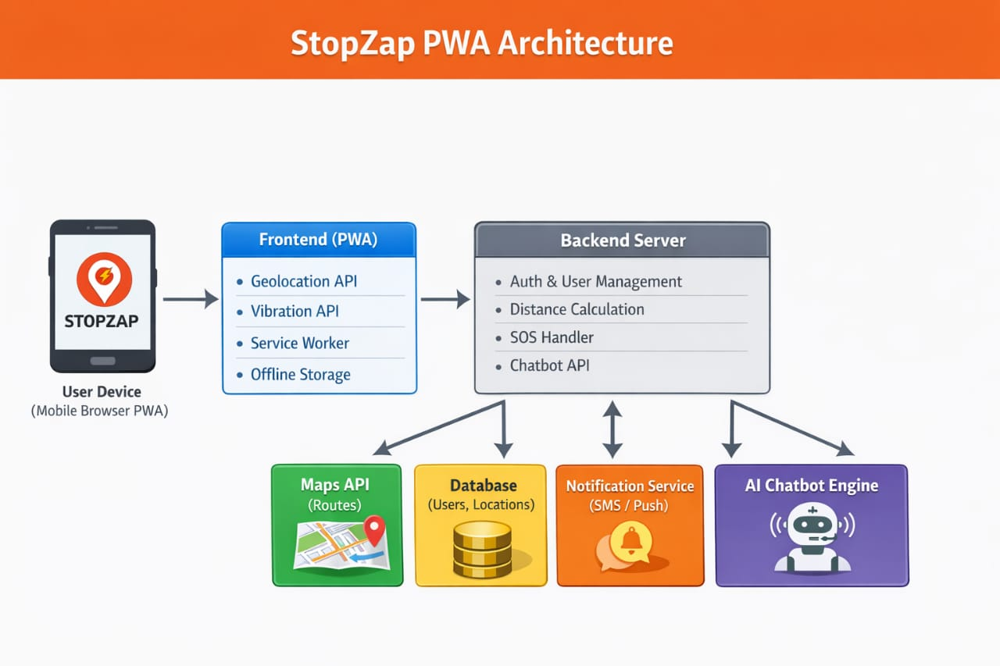
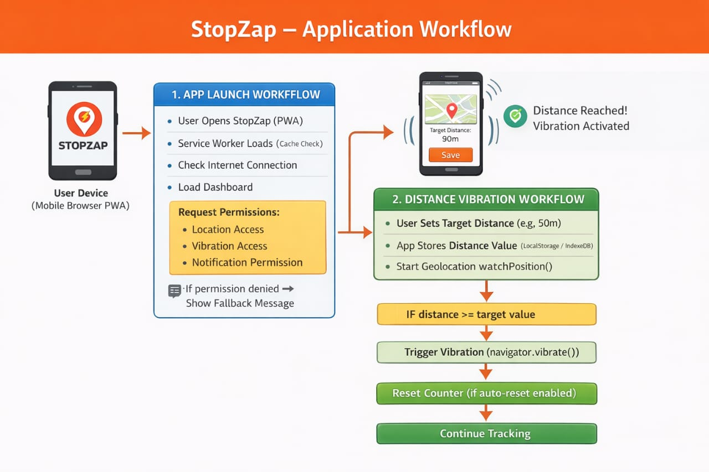

<p align="center">
  
</p>

# StopZap 🎯

## Basic Details

### Team Name: [SheVerse]

### Team Members
- Member 1: [Fathima Nehla P S] - [SCMS School Of Engineering and Technology]
- Member 2: [Hanna Abdul Kareem] - [SCMS School Of Engineering and Technology]

### Hosted Project Link
[mention your project hosted link here]

### Project Description
[Stopzap is a smart GPS-powered Progressive Web App that ensures you never miss your bus or train stop again with real-time proximity alerts, live mapping, and customizable alert radius. It features an AI assistant chatbot for journey support, emergency SOS alerts with location sharing and nearest police station detection, sun/shade tracking via Veyl for smart seat selection, offline functionality, and a simulation mode for testing—all wrapped in an intuitive dark-themed interface with offline-first capabilities.]

### The Problem statement
[Commuters frequently miss their bus or train stops due to distractions or unfamiliarity with routes, wasting time and money. They lack a comprehensive tool that combines real-time proximity alerts, emergency safety features, and offline accessibility to enhance their transit experience and safety.]

### The Solution
[Solution - Key Points:

• Automatic proximity-based alerts when approaching destination
• Real-time GPS tracking with live distance display
• Emergency SOS with location sharing & police station detection
• AI chatbot assistant for journey queries
• Offline-first PWA with simulation mode

Why Stopzap Beats Google Maps:

• Automatic Alerts - Notifies you automatically vs manual checks in Google Maps
• Emergency Safety - Built-in SOS with police detection (Google Maps lacks this)
• Lightweight PWA - Works instantly in browser, no installation needed
• Full Offline Support - Works without internet connectivity
• Transit-Focused - Purpose-built for commuters with AI chatbot & simulation mode]

---

## Technical Details

### Technologies/Components Used

**For Software:**
- Languages used: HTML5, CSS3, JavaScript (ES6+)
- Frameworks used:Progressive Web App (PWA), Vanilla JavaScript (no framework)
- Libraries used: Leaflet.js (mapping), Nominatim API (geocoding), Overpass API (police station detection)
- Tools used: VS Code, Git, GitHub, Leaflet Map Library, Service Workers, LocalStorage API

---

## Features

List the key features of your project:

- **Real-time Proximity Alerts:** Automatic notifications when you approach your destination within a customizable radius, ensuring you never miss your stop
- **Emergency SOS with Police Detection:** One-click emergency alert that shares your live location and detects the nearest police station, sending critical information to your saved emergency contact
- **AI Assistant Chatbot:** Interactive chatbot that answers questions about journey status, distance to destination, tracking help, emergency procedures, and app features with intelligent context-aware responses
- **Offline-First Progressive Web App:** Full offline functionality with Service Worker caching - works seamlessly without internet connectivity, with automatic sync when back online
- **Live GPS Tracking & Distance Display:** Real-time location tracking on interactive Leaflet maps with current coordinates and live distance updates to your destination
- **Simulation Mode:** Test your routing without GPS by simulating a journey to your destination - perfect for familiarizing yourself with routes before travel
- **Veyl Sun/Shade Tracker:** Shows sun direction and shade availability on your route, helping you choose the best seat for comfort during your journey
- **Emergency Contact Management:** Pre-save emergency contact details on landing page, instantly accessible during SOS situations for rapid emergency alerts

---

## Implementation

### For Software:

#### Installation
```bash
# Clone the repository
git clone https://github.com/Hannakareem/Stopzap.git
cd stopzap

# No build dependencies required - it's a vanilla PWA!
```

#### Run
```bash
# Option 1: Python server
python -m http.server 8000

# Option 2: Node.js server
npx http-server

# Then visit: http://localhost:5500/landing.html
```


## Project Documentation

### For Software:

#### Screenshots (Add at least 3)


*Emergency Contact Modal - Users save their trusted emergency contact (name, phone, and relationship) on the landing page, which is instantly accessible during SOS situations for rapid emergency alerts*


*Add caption explaining what this shows*


*Add caption explaining what this shows*

#### Diagrams

**System Architecture:**


*Explain your system architecture - components, data flow, tech stack interaction*

**Application Workflow:**


*Add caption explaining your workflow*

---

### For Hardware:

#### Schematic & Circuit


*Add caption explaining connections*


*Add caption explaining the schematic*

#### Build Photos


*List out all components shown*


*Explain the build steps*


*Explain the final build*

---

## Additional Documentation

### For Web Projects with Backend:

#### API Documentation

**Base URL:** `https://api.yourproject.com`

##### Endpoints

**GET /api/endpoint**
- **Description:** [What it does]
- **Parameters:**
  - `param1` (string): [Description]
  - `param2` (integer): [Description]
- **Response:**
```json
{
  "status": "success",
  "data": {}
}
```

**POST /api/endpoint**
- **Description:** [What it does]
- **Request Body:**
```json
{
  "field1": "value1",
  "field2": "value2"
}
```
- **Response:**
```json
{
  "status": "success",
  "message": "Operation completed"
}
```

[Add more endpoints as needed...]

---

### For Mobile Apps:

#### App Flow Diagram


*Explain the user flow through your application*

#### Installation Guide

**For Android (APK):**
1. Download the APK from [Release Link]
2. Enable "Install from Unknown Sources" in your device settings:
   - Go to Settings > Security
   - Enable "Unknown Sources"
3. Open the downloaded APK file
4. Follow the installation prompts
5. Open the app and enjoy!

**For iOS (IPA) - TestFlight:**
1. Download TestFlight from the App Store
2. Open this TestFlight link: [Your TestFlight Link]
3. Click "Install" or "Accept"
4. Wait for the app to install
5. Open the app from your home screen

**Building from Source:**
```bash
# For Android
flutter build apk
# or
./gradlew assembleDebug

# For iOS
flutter build ios
# or
xcodebuild -workspace App.xcworkspace -scheme App -configuration Debug
```

---

### For Hardware Projects:

#### Bill of Materials (BOM)

| Component | Quantity | Specifications | Price | Link/Source |
|-----------|----------|----------------|-------|-------------|
| Arduino Uno | 1 | ATmega328P, 16MHz | ₹450 | [Link] |
| LED | 5 | Red, 5mm, 20mA | ₹5 each | [Link] |
| Resistor | 5 | 220Ω, 1/4W | ₹1 each | [Link] |
| Breadboard | 1 | 830 points | ₹100 | [Link] |
| Jumper Wires | 20 | Male-to-Male | ₹50 | [Link] |
| [Add more...] | | | | |

**Total Estimated Cost:** ₹[Amount]

#### Assembly Instructions

**Step 1: Prepare Components**
1. Gather all components listed in the BOM
2. Check component specifications
3. Prepare your workspace

*Caption: All components laid out*

**Step 2: Build the Power Supply**
1. Connect the power rails on the breadboard
2. Connect Arduino 5V to breadboard positive rail
3. Connect Arduino GND to breadboard negative rail

*Caption: Power connections completed*

**Step 3: Add Components**
1. Place LEDs on breadboard
2. Connect resistors in series with LEDs
3. Connect LED cathodes to GND
4. Connect LED anodes to Arduino digital pins (2-6)

*Caption: LED circuit assembled*

**Step 4: [Continue for all steps...]**

**Final Assembly:**

*Caption: Completed project ready for testing*

---

### For Scripts/CLI Tools:

#### Command Reference

**Basic Usage:**
```bash
python script.py [options] [arguments]
```

**Available Commands:**
- `command1 [args]` - Description of what command1 does
- `command2 [args]` - Description of what command2 does
- `command3 [args]` - Description of what command3 does

**Options:**
- `-h, --help` - Show help message and exit
- `-v, --verbose` - Enable verbose output
- `-o, --output FILE` - Specify output file path
- `-c, --config FILE` - Specify configuration file
- `--version` - Show version information

**Examples:**

```bash
# Example 1: Basic usage
python script.py input.txt

# Example 2: With verbose output
python script.py -v input.txt

# Example 3: Specify output file
python script.py -o output.txt input.txt

# Example 4: Using configuration
python script.py -c config.json --verbose input.txt
```

#### Demo Output

**Example 1: Basic Processing**

**Input:**
```
This is a sample input file
with multiple lines of text
for demonstration purposes
```

**Command:**
```bash
python script.py sample.txt
```

**Output:**
```
Processing: sample.txt
Lines processed: 3
Characters counted: 86
Status: Success
Output saved to: output.txt
```

**Example 2: Advanced Usage**

**Input:**
```json
{
  "name": "test",
  "value": 123
}
```

**Command:**
```bash
python script.py -v --format json data.json
```

**Output:**
```
[VERBOSE] Loading configuration...
[VERBOSE] Parsing JSON input...
[VERBOSE] Processing data...
{
  "status": "success",
  "processed": true,
  "result": {
    "name": "test",
    "value": 123,
    "timestamp": "2024-02-07T10:30:00"
  }
}
[VERBOSE] Operation completed in 0.23s
```

---

## Project Demo

### Video
[Add your demo video link here - YouTube, Google Drive, etc.]

*Explain what the video demonstrates - key features, user flow, technical highlights*

### Additional Demos
[Add any extra demo materials/links - Live site, APK download, online demo, etc.]

---

## AI Tools Used (Optional - For Transparency Bonus)

If you used AI tools during development, document them here for transparency:

**Tool Used:** [e.g., GitHub Copilot, v0.dev, Cursor, ChatGPT, Claude]

**Purpose:** [What you used it for]
- Example: "Generated boilerplate React components"
- Example: "Debugging assistance for async functions"
- Example: "Code review and optimization suggestions"

**Key Prompts Used:**
- "Create a REST API endpoint for user authentication"
- "Debug this async function that's causing race conditions"
- "Optimize this database query for better performance"

**Percentage of AI-generated code:** [Approximately X%]

**Human Contributions:**
- Architecture design and planning
- Custom business logic implementation
- Integration and testing
- UI/UX design decisions

*Note: Proper documentation of AI usage demonstrates transparency and earns bonus points in evaluation!*

---

## Team Contributions

- [Name 1]: [Specific contributions - e.g., Frontend development, API integration, etc.]
- [Name 2]: [Specific contributions - e.g., Backend development, Database design, etc.]
- [Name 3]: [Specific contributions - e.g., UI/UX design, Testing, Documentation, etc.]

---

## License

This project is licensed under the [LICENSE_NAME] License - see the [LICENSE](LICENSE) file for details.

**Common License Options:**
- MIT License (Permissive, widely used)
- Apache 2.0 (Permissive with patent grant)
- GPL v3 (Copyleft, requires derivative works to be open source)

---

Made with ❤️ at TinkerHub
